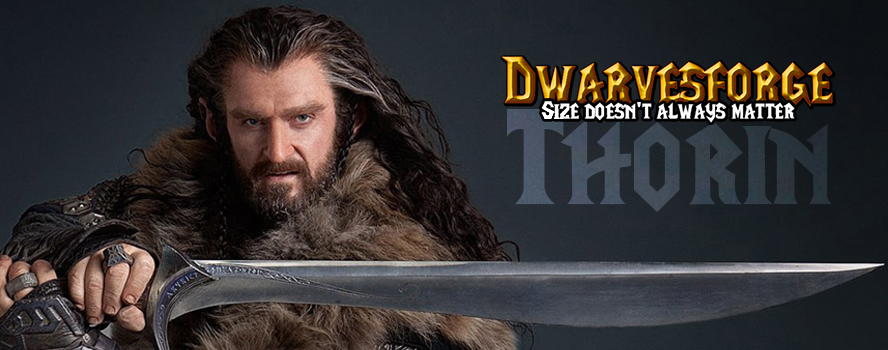

# Thorin

<p>
	<!-- <a href="https://travis-ci.org/Coffeekraken/sugar">
		
	</a>
	<a href="https://www.npmjs.com/package/coffeekraken-sugar">
		
	</a>
	<a href="https://github.com/Coffeekraken/sugar/blob/master/LICENSE.txt">
		
	</a> -->
	<!-- <a href="https://github.com/coffeekraken/sugar">
		
	</a>
	<a href="https://github.com/coffeekraken/sugar">
		
	</a>
	<a href="https://github.com/coffeekraken/sugar">
		
	</a>-->
	<!-- <a href="https://twitter.com/coffeekrakenio">
		
	</a>
	<a href="http://coffeekraken.io">
		
	</a> -->
</p>

Thorin is a pretty simple toolkit that gives you a lot of cool helpers functions in multiple areas like:

- Views
	- [`Thorin::render_blade`](doc/src/functions/views/t_render_blade.md) : let you quickly render some blade templates
	- [Many more](doc/src/functions/views) 
- Paths
	- [`Thorin::asset_path`](doc/src/functions/paths/t_asset_path.md) : return an asset (image, video, etc...) path relative to the `T_ASSETS_PATH` constant
	- [`Thorin::asset_url`](doc/src/functions/paths/t_asset_url.md) : return an asset (image, video, etc...) url absolute to the `T_DOMAIN` and `T_ASSETS_PATH` constant
	- [Many more](doc/src/functions/paths)
- Images
	- [`Thorin::optimize_image`](doc/src/functions/images/t_optimize_image.md) : Resize and compress the passed image and return back the newly compressed image path
	- [Many more](doc/src/functions/images) 
- Strings
	- [`Thorin::tailslash`](doc/src/functions/strings/t_tailslash.md) : Make sure the passed string has a `/` at the end
	- [Many more](doc/src/functions/strings)
- Utils
	- [`Thorin::is_ajax_request`](doc/src/functions/utils/t_is_ajax_request.md) : Return if the script has been called using ajax or not
	- [`Thorin::is_crawler`](doc/src/functions/utils/t_is_crawler.md) : Return if the script has been called by a web crawler like the google bot, etc...
	- [Many more](doc/src/functions/utils)
- [Many more](doc/src)

## Table of content

1. [Goals](#readme-goals)
2. [Install](#readme-install)
3. [Documentation](doc)
4. [Contribute](#readme-contribute)
5. [License](#readme-license)
6. [Who are Dwarvesforge](#readme-who-are-dwarvesforge)

<a id="readme-goals"></a>
## Goals

The main goal of this toolkit is to **gives you some nice and powerful features through a simple API**.
We will make this package grow every time we encounter and implement some nice functions/classes/helpers.

<a id="readme-install"></a>
## Install

```
composer require dwarvesforge/thorin
```

<a id="readme-contribute"></a>
## Contribute

Dwarvesforge is an open source project and will ever be! You are more that welcomed to contribute to his development and make it more awesome every day.
To do so, you have several possibilities:

1. [Share the love ❤️](https://github.com/Dwarvesforge/dwarvesforge/blob/master/contribute.md#contribute-share-the-love)
2. [Declare issues](https://github.com/Dwarvesforge/dwarvesforge/blob/master/contribute.md#contribute-declare-issues)
3. [Fix issues](https://github.com/Dwarvesforge/dwarvesforge/blob/master/contribute.md#contribute-fix-issues)
4. [Add features](https://github.com/Dwarvesforge/dwarvesforge/blob/master/contribute.md#contribute-add-features)

<a id="readme-license"></a>
## License

The code is available under the [MIT license](LICENSE.txt). This mean that you can use, modify, or do whatever you want with it. This mean also that it is shipped to you for free, so don't be a hater and if you find some issues, etc... feel free to [contribute](https://github.com/Dwarvesforge/dwarvesforge/blob/master/contribute.md) instead of sharing your frustrations on social networks like an asshole...

<a id="readme-who-are-dwarvesforge"></a>
## Who are Dwarvesforge

We try to be **some cool guys** that build **some cool tools** to make our (and yours hopefully) **every day life better**.  

#### [More on who we are](https://github.com/Dwarvesforge/dwarvesforge/blob/master/who-are-we.md)
